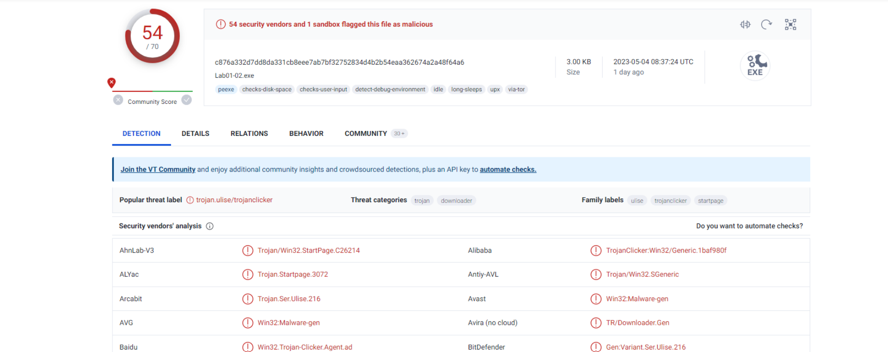
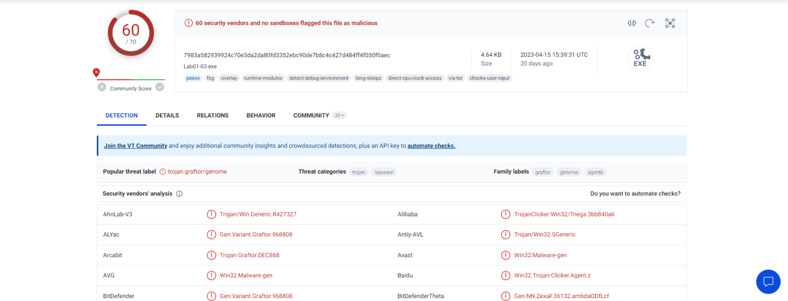
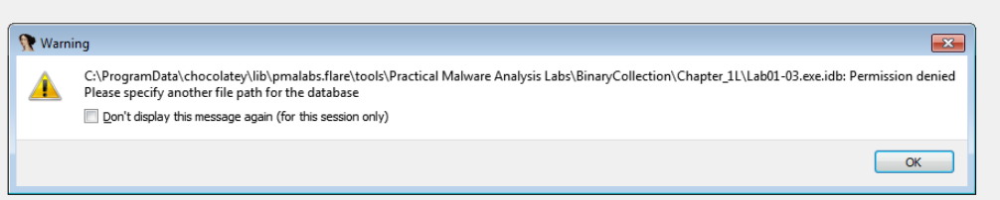
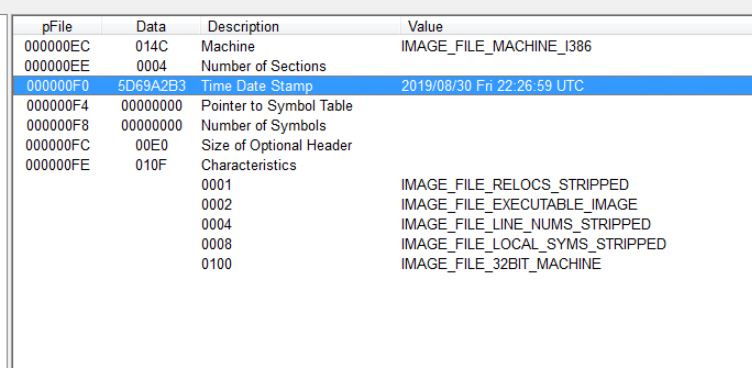

# Static Analysis

## SillyPutty:
1. the sha256 hashcode is "90e8c97bedc9f7ae82dccc7c0210bab010a090f183df68b4c7f3a85e92fccd8a".
2. By using **PEstudio** it looks like it's a 32-bit archtiture. 
   
3. unfortunately no, it looks like it's a fresh malware.
4. After searching for strings with **floss** and **PEstudio** it looks like it's another deadend as the is lots of strings which isn't malicious by necessity

5. It looks like it's unpacked because the diffrence between the virtual size and the size of rows Data is quite close 
   
## Lap 01-01:
1. Yup, 54/70 Antivirus have identified as malware (trojan).
2. Using **PEview** it shows that it was uploaded in 19/12/2010
3. I can't find any indications that either file is packed or obfuscated, also **PEid** had idintified it as a microsoft visual C++ file.
4. For *q 4,5,6,7* I think they depend on knowing th API functions which I don't so I will dig into it for a while then go back and solve them later.

## Lap 01-02:
1. Same as the Previous one, 54/70 Antivirus have identified as malware (trojan).
2. * first, using **peid** EP section tells us that it maybe packed using UPX1.
   * second, using **peview** it's obvious that there is there sections called UPX0, UPX1, UPX2 which mean it's packed. 
   * third, If you need to unpack it you could easily use **UPX**.  
3. --
4. I don't known what this malware actually does I may know after doing some dynamic analysis.

## Lap 01-03:
1. OMG, this one is familiar to more than 60 antiviruses on virustotal.
2. * first, using **peid** it tell us that it's an FSG 1.0 -> dulek/xt, after some search I knew that this is another way to pack a malware.
   * second, using **peview** I didn't actually understand the sections names were empty and i didn't know what does this mean
   * third, I used **IDA Framework** to make sure, It is obvious now that this malware is packed.
   * forth, with some search I found that the process isn't just running an un-pack command like with **upx**, it has some other complicated steps.
3. without unpacking the file we can't know for sure what imports hints tell us.
4. without unpacking the file we can't know for sure what if the *host* or *network-based* indicators could be used to identify this malware on infected machines.

##Lao 01-04:
1. As usuall in this chapter it has been caught as malicious software by 57 antiviruse. 
2. According to **PEid** it's a microsoft visual C++ file.
3. Using **PEview** it looks like it was compiled on 30/8/2019 .
4. As I mentioned in Lap 01-01 Q4.
