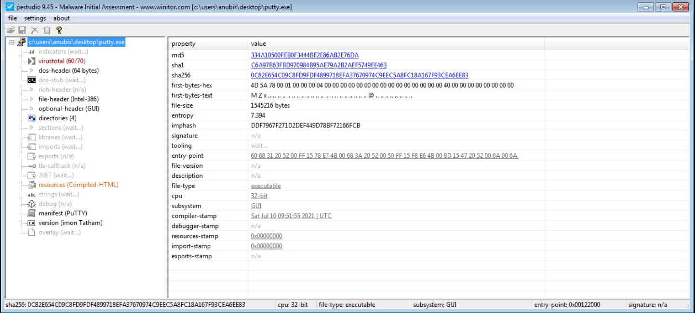
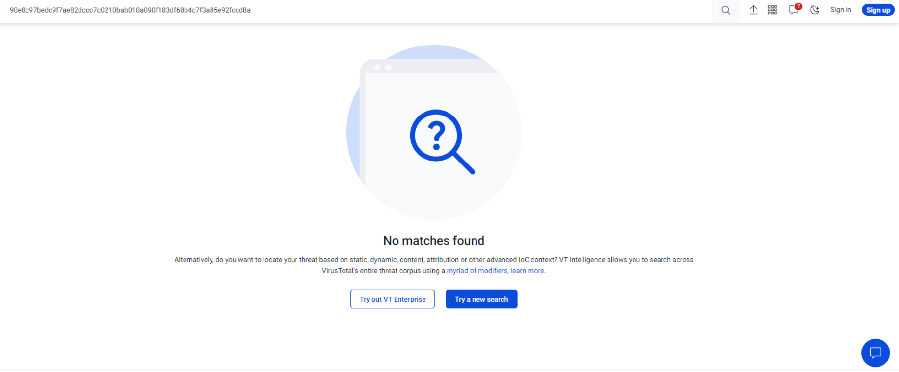
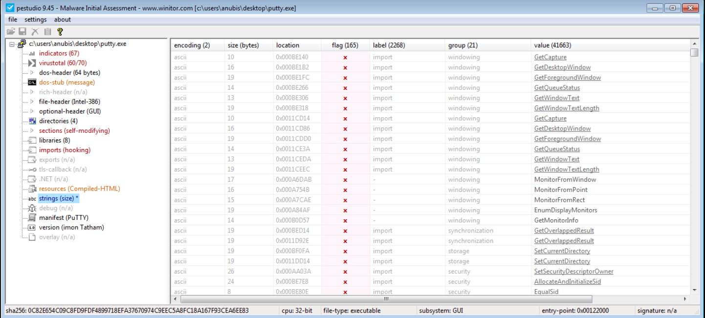
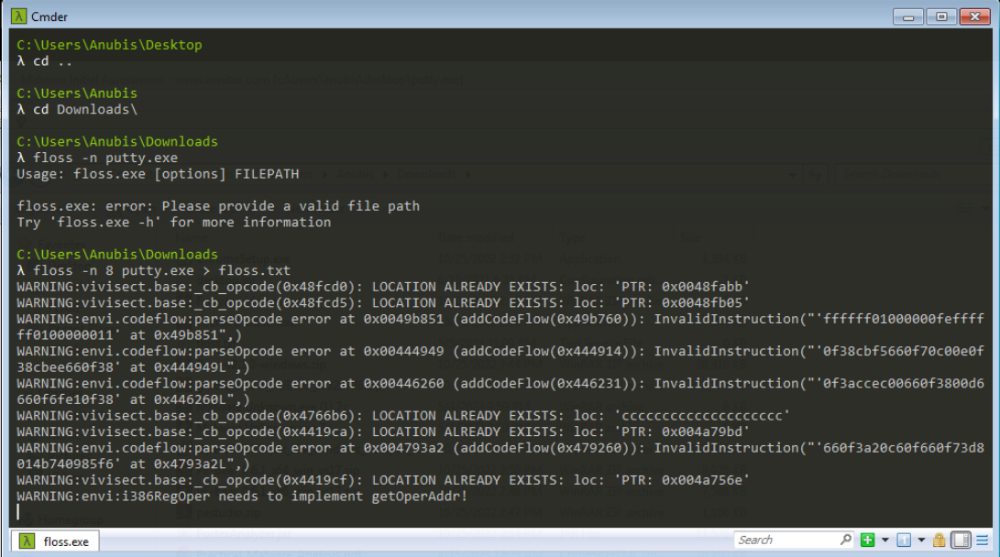
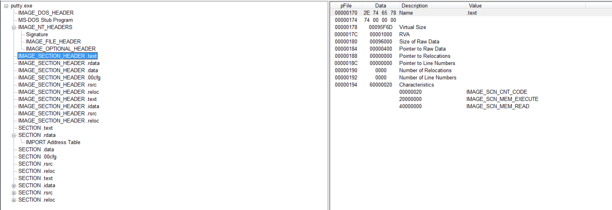

## SillyPutty:
1. the sha256 hashcode is "90e8c97bedc9f7ae82dccc7c0210bab010a090f183df68b4c7f3a85e92fccd8a".
    ___
2. By using **PEstudio** it looks like it's a 32-bit archtiture. 

    ___
   
3. unfortunately no, it looks like it's a fresh malware.

    ___
4. After searching for strings with **floss** and **PEstudio** it looks like it's another deadend as the is lots of strings which isn't malicious by necessity 
            
    
    ___
5. It looks like it's unpacked because the diffrence between the virtual size and the size of rows Data is quite close 
    ___
6. There are no header sections that tell us if it's a packing stub, although the Size of the Raw Data and Virtual Size of the headers are close values, so I think it's unpacked binary